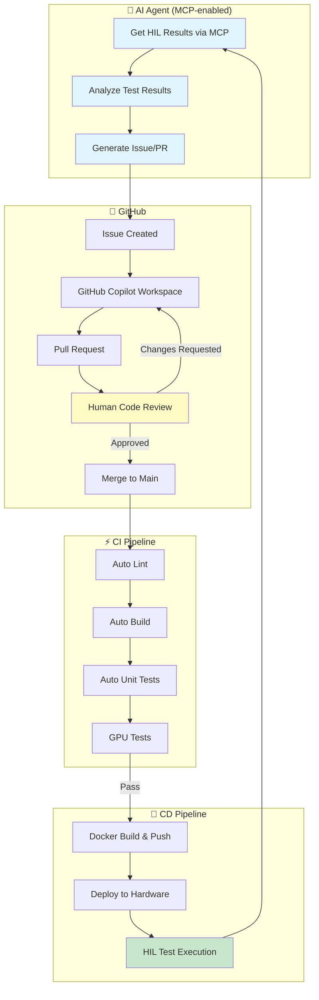
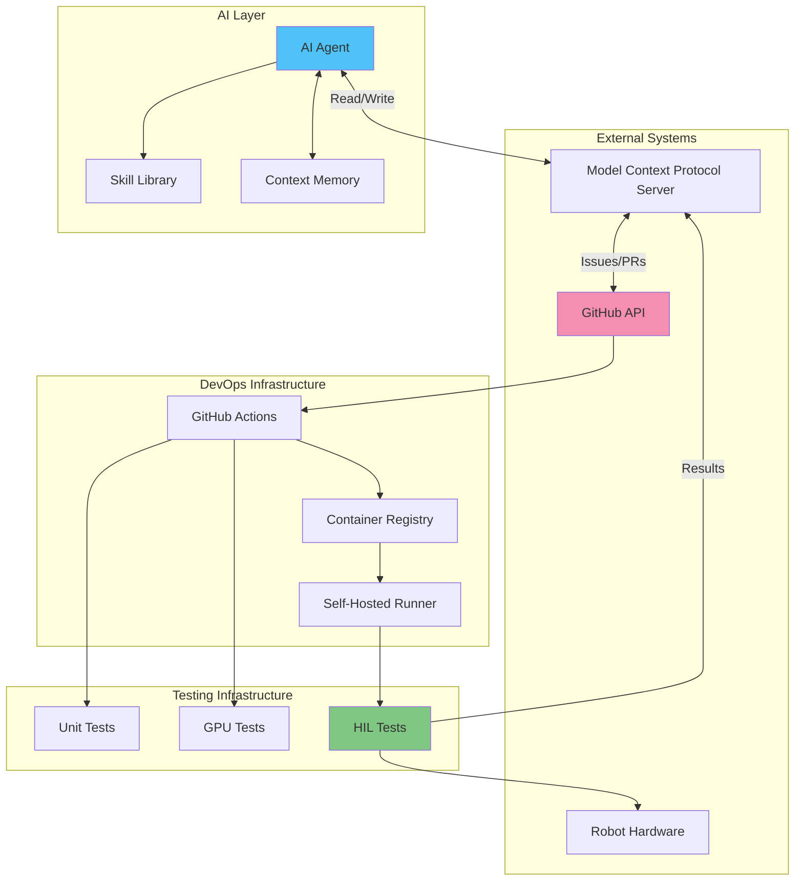
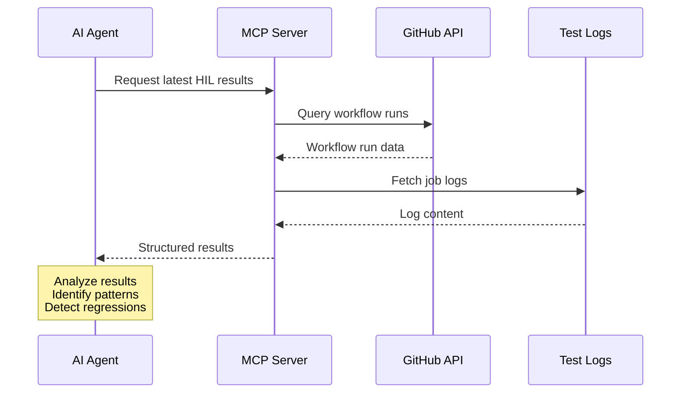
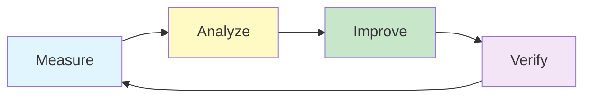

# AI-Driven Hardware-in-the-Loop (HIL) Development Pattern

## Table of Contents

- [Overview](#overview)
- [Development Loop](#development-loop)
- [Architecture](#architecture)
- [Key Components](#key-components)
- [Workflow Details](#workflow-details)
- [Benefits](#benefits)
- [Integration with LibroBot VLA](#integration-with-librobot-vla)
- [Implementation Guide](#implementation-guide)
- [Security Considerations](#security-considerations)
- [Best Practices](#best-practices)

## Overview

This document describes an AI-driven software development pattern that leverages Hardware-in-the-Loop (HIL) testing to create a **continuous improvement loop** for robotics software. The pattern enables AI agents to:

1. **Observe**: Retrieve HIL test results via Model Context Protocol (MCP)
2. **Analyze**: Identify issues, failures, or improvement opportunities
3. **Propose**: Submit issues or code changes via GitHub Copilot
4. **Iterate**: Automatically trigger CI/CD pipelines to validate and deploy changes
5. **Learn**: Get updated HIL results and continue the improvement cycle

This creates an autonomous development pipeline where AI actively participates in the software development lifecycle while maintaining human oversight through code review.

## Development Loop

The AI-driven HIL development pattern follows a continuous feedback loop:



### Simplified Flow

```
┌─────────────────────────────────────────────────────────────────────────────┐
│                        AI-Driven HIL Development Loop                       │
│                                                                             │
│  ┌─────────┐    ┌─────────┐    ┌─────────┐    ┌─────────┐    ┌─────────┐   │
│  │   AI    │───▶│  Issue  │───▶│   PR    │───▶│ Review  │───▶│  Merge  │   │
│  │  Agent  │    │ (Skill) │    │(Copilot)│    │ (Human) │    │ (Auto)  │   │
│  └─────────┘    └─────────┘    └─────────┘    └─────────┘    └─────────┘   │
│       ▲                                                            │        │
│       │                                                            ▼        │
│       │         ┌─────────┐    ┌─────────┐    ┌─────────┐    ┌─────────┐   │
│       └─────────│   HIL   │◀───│ Deploy  │◀───│  Build  │◀───│   CI    │   │
│                 │  Tests  │    │   CD    │    │ Docker  │    │ Lint/UT │   │
│                 └─────────┘    └─────────┘    └─────────┘    └─────────┘   │
│                                                                             │
└─────────────────────────────────────────────────────────────────────────────┘
```

## Architecture

### System Components



### Data Flow

| Step | Component | Action | Data |
|------|-----------|--------|------|
| 1 | AI Agent | Query MCP | HIL test results, logs, metrics |
| 2 | AI Agent | Analyze | Identify failures, regressions |
| 3 | AI Agent | Create Issue | Problem description, proposed fix |
| 4 | Copilot | Process Issue | Generate code changes |
| 5 | GitHub | Create PR | Code diff, test changes |
| 6 | Human | Review PR | Approve/Request changes |
| 7 | GitHub | Merge | Update main branch |
| 8 | CI | Lint/Build/Test | Validation results |
| 9 | CD | Deploy | Container to hardware |
| 10 | HIL | Execute Tests | Performance metrics |
| 11 | MCP | Store Results | Available for next cycle |

## Key Components

### 1. Model Context Protocol (MCP)

MCP enables AI agents to interact with development tools and retrieve test results:

```python
# Example MCP interaction for HIL results
from mcp import MCPClient

async def get_hil_results(run_id: str) -> dict:
    """Retrieve HIL test results via MCP."""
    async with MCPClient() as client:
        # Get workflow run details
        run = await client.github.get_workflow_run(
            owner="wfhit",
            repo="librobot_vla",
            run_id=run_id
        )
        
        # Get job logs
        logs = await client.github.get_job_logs(
            owner="wfhit",
            repo="librobot_vla",
            run_id=run_id,
            failed_only=True
        )
        
        return {
            "status": run.conclusion,
            "logs": logs,
            "artifacts": run.artifacts
        }
```

### 2. AI Agent Skills

Skills are predefined capabilities the AI agent can use:

```python
# Issue creation skill
class CreateIssueSkill:
    """Skill for creating GitHub issues from HIL analysis."""
    
    async def execute(
        self,
        title: str,
        body: str,
        labels: list[str] = None
    ) -> str:
        """Create a new issue with HIL findings."""
        return await self.mcp.github.create_issue(
            owner="wfhit",
            repo="librobot_vla",
            title=title,
            body=body,
            labels=labels or ["hil-feedback", "ai-generated"]
        )
```

### 3. GitHub Copilot Integration

GitHub Copilot processes issues and generates code changes:

- **Issue Analysis**: Copilot reads issue description and context
- **Code Generation**: Proposes fixes based on issue details
- **PR Creation**: Creates pull request with changes
- **Review Integration**: Responds to review comments

### 4. CI/CD Pipeline

The existing LibroBot VLA CI/CD infrastructure supports this pattern:

#### CI Pipeline (`ci-lint.yml`)
- Code formatting validation (black, isort, ruff)
- Type checking
- Unit tests

#### Docker Build (`ci-docker-build.yml`)
- Build training container
- Push to GitHub Container Registry

#### HIL Tests (`ci-hil-tests.yml`)
- GPU environment verification
- GPU-specific tests
- Full test suite on hardware

## Workflow Details

### Phase 1: AI Observation



### Phase 2: Issue Submission

The AI agent creates structured issues:

```markdown
## HIL Test Failure Analysis

**Run ID**: #12345
**Timestamp**: 2024-12-15T10:30:00Z
**Hardware**: GPU Runner (self-hosted)

### Failure Summary

- **Test**: `test_groot_forward_pass`
- **Error**: CUDA OOM during diffusion step
- **Frequency**: 3/5 runs this week

### Root Cause Analysis

Based on memory profiling data:
1. Peak memory occurs at diffusion timestep 50
2. Batch size 32 exceeds available VRAM
3. Gradient checkpointing not enabled

### Proposed Fix

1. Enable gradient checkpointing in `GR00TVLA.forward()`
2. Add memory monitoring callback
3. Update default batch size in config

### Acceptance Criteria

- [ ] Tests pass with batch_size=32
- [ ] Memory usage < 16GB peak
- [ ] No regression in inference speed
```

### Phase 3: GitHub Copilot Processing

1. **Issue Assignment**: Copilot workspace activated
2. **Context Loading**: Related files, tests, configs
3. **Code Generation**: Implementation following patterns
4. **PR Creation**: Structured commit messages

### Phase 4: Human Review

Human reviewers ensure:

- ✅ Code quality and correctness
- ✅ Security implications reviewed
- ✅ Test coverage adequate
- ✅ Documentation updated
- ✅ Performance implications considered

### Phase 5: CI Validation

```yaml
# Triggered on PR merge to main
on:
  push:
    branches: [main]

jobs:
  lint:
    # Code style checks
    
  build:
    # Docker image build
    
  test:
    # Unit and integration tests
    
  hil:
    # Hardware-in-the-loop tests
    needs: [lint, build, test]
```

### Phase 6: CD and HIL

```yaml
# From ci-hil-tests.yml
jobs:
  hil-tests:
    runs-on: [self-hosted, linux, x64]
    container:
      image: ghcr.io/${{ github.repository_owner }}/librobot-train:latest
      options: --gpus all
    
    steps:
      - name: Run GPU tests
        run: pytest tests/ -v -m "gpu"
      
      - name: Run full test suite
        run: pytest tests/ -v -m "not slow"
```

## Benefits

### For Development Teams

| Benefit | Description |
|---------|-------------|
| **Faster Iteration** | AI-driven analysis reduces time to identify issues |
| **Continuous Improvement** | Automated feedback loop for ongoing optimization |
| **Reduced Manual Work** | AI handles routine analysis and issue creation |
| **Consistent Quality** | Standardized issue format and analysis depth |

### For AI Systems

| Benefit | Description |
|---------|-------------|
| **Real Hardware Feedback** | Learn from actual robot behavior |
| **Continuous Learning** | Each cycle improves understanding |
| **Verified Changes** | Human review ensures quality |
| **Measurable Progress** | HIL metrics track improvement |

### For Organizations

| Benefit | Description |
|---------|-------------|
| **Scalable Development** | AI assists with routine tasks |
| **Knowledge Capture** | Issues document problems and solutions |
| **Audit Trail** | Full history of changes and rationale |
| **Quality Gates** | Human review maintains standards |

## Integration with LibroBot VLA

### Existing Infrastructure

LibroBot VLA already has the foundational infrastructure:

1. **CI/CD Workflows**
   - `ci-lint.yml`: Code quality checks
   - `ci-docker-build.yml`: Container builds
   - `ci-hil-tests.yml`: Hardware testing

2. **Registry Pattern**
   - Components are discoverable and replaceable
   - Easy to add new test fixtures

3. **Configuration System**
   - YAML-based configuration
   - CLI overrides for experimentation

### Enabling AI Integration

To enable AI-driven development:

```yaml
# .github/workflows/ai-feedback.yml
name: AI Feedback Integration

on:
  workflow_run:
    workflows: ["HIL Tests"]
    types: [completed]

jobs:
  publish-results:
    runs-on: ubuntu-latest
    steps:
      - name: Export HIL Results
        uses: actions/upload-artifact@v4
        with:
          name: hil-results
          path: |
            test-results/
            logs/
          
      - name: Notify MCP Server
        run: |
          curl -X POST "${{ secrets.MCP_WEBHOOK_URL }}" \
            -H "Content-Type: application/json" \
            -d '{
              "run_id": "${{ github.run_id }}",
              "status": "${{ github.event.workflow_run.conclusion }}",
              "repository": "${{ github.repository }}"
            }'
```

## Implementation Guide

### Step 1: Set Up MCP Server

```bash
# Install MCP server for GitHub integration
npm install -g @modelcontextprotocol/server-github

# Configure with repository access
export GITHUB_TOKEN=your_token
mcp-server-github --repo wfhit/librobot_vla
```

### Step 2: Configure AI Agent

```python
# agent_config.py
config = {
    "mcp_endpoint": "http://localhost:3000",
    "repository": "wfhit/librobot_vla",
    "skills": [
        "get_hil_results",
        "analyze_test_failures",
        "create_issue",
        "suggest_fix"
    ],
    "review_required": True,  # Always require human review
    "auto_create_pr": False,  # Use Copilot for PR creation
}
```

### Step 3: Define Analysis Rules

```yaml
# analysis_rules.yaml
rules:
  - name: memory_regression
    trigger: "CUDA out of memory"
    severity: high
    labels: ["memory", "regression"]
    
  - name: test_flakiness
    trigger: "test passed after retry"
    severity: medium
    labels: ["flaky-test"]
    
  - name: performance_regression
    trigger: "inference time > 100ms"
    severity: high
    labels: ["performance", "regression"]
```

### Step 4: Enable Feedback Loop

```yaml
# .github/workflows/ai-loop.yml
name: AI Development Loop

on:
  issues:
    types: [opened]
    
jobs:
  process-ai-issue:
    if: contains(github.event.issue.labels.*.name, 'ai-generated')
    runs-on: ubuntu-latest
    steps:
      - name: Assign to Copilot
        uses: actions/github-script@v7
        with:
          script: |
            // Trigger Copilot workspace for AI-generated issues
            console.log('Issue ready for Copilot processing')
```

## Security Considerations

### Access Control

```yaml
# Principle of least privilege
permissions:
  ai_agent:
    - read: workflow_runs
    - read: job_logs
    - write: issues
    # No direct code push access
    
  github_copilot:
    - read: issues
    - write: pull_requests
    # Human review required for merge
```

### Review Requirements

- **All AI-generated code must be reviewed by humans**
- Branch protection rules enforce review requirements
- Security scanning on all PRs

### Audit Logging

```yaml
audit:
  log_ai_actions: true
  log_format: json
  retention_days: 90
  
  captured_events:
    - issue_created
    - pr_created
    - review_requested
    - merge_completed
```

## Best Practices

### 1. Issue Quality

**DO:**
- Include specific error messages and logs
- Provide reproduction steps
- Reference related issues or PRs
- Include acceptance criteria

**DON'T:**
- Create vague or duplicate issues
- Skip root cause analysis
- Ignore test coverage requirements

### 2. Human Review

**Reviewers should:**
- Verify AI analysis is correct
- Check for edge cases AI might miss
- Ensure changes don't introduce regressions
- Consider broader system impact

### 3. Continuous Improvement



Track metrics:
- Time from HIL failure to fix
- AI suggestion acceptance rate
- Regression introduction rate
- Test coverage trends

### 4. Graceful Degradation

The system should work even if components fail:

| Component Failure | Fallback Behavior |
|-------------------|-------------------|
| MCP unavailable | Manual issue creation |
| AI analysis fails | Human triages HIL results |
| Copilot unavailable | Traditional development |
| CI fails | Block merge, notify team |

---

## Related Documentation

- [Deployment Guide](deployment.md) - Production deployment
- [HIL Tests Workflow](../.github/workflows/ci-hil-tests.yml) - HIL test configuration
- [Design Principles](design/DESIGN_PRINCIPLES.md) - Framework architecture
- [Roadmap](design/ROADMAP.md) - Future development plans

## Conclusion

The AI-driven HIL development pattern creates a powerful feedback loop that:

1. **Leverages AI** for continuous monitoring and analysis
2. **Maintains quality** through human code review
3. **Validates changes** with real hardware testing
4. **Accelerates development** by automating routine tasks

By integrating AI agents with existing CI/CD infrastructure, teams can achieve faster iteration cycles while maintaining high code quality and safety standards for robotics applications.
