# LibroBot VLA Framework Architecture

## Table of Contents
- [Overview](#overview)
- [System Architecture](#system-architecture)
- [Component Relationships](#component-relationships)
- [Data Flow](#data-flow)
- [Registry Pattern](#registry-pattern)
- [Plugin Architecture](#plugin-architecture)
- [Module Deep Dive](#module-deep-dive)

### Related Documents
- [Computing Platform Architecture](COMPUTING_PLATFORM.md) — HPC + Orin NX deployment topology for wheel loader applications

## Overview

LibroBot VLA is a comprehensive framework for building Vision-Language-Action (VLA) models for robot learning. The framework is designed with modularity, extensibility, and type safety as core principles.

### Key Features
- **8 VLA Framework Implementations**: GR00T, π0, Octo, OpenVLA, RT-2, ACT, Helix, Custom
- **5 VLM Backend Families**: Qwen-VL, Florence-2, PaliGemma, InternVL2, LLaVA
- **Registry-based Plugin System**: Easy extensibility without modifying core code
- **Config-driven Design**: YAML/JSON configuration for reproducibility
- **Type Safety**: Complete type hints for IDE support and error prevention
- **Modular Components**: Mix-and-match architecture components

## System Architecture

### High-Level Architecture

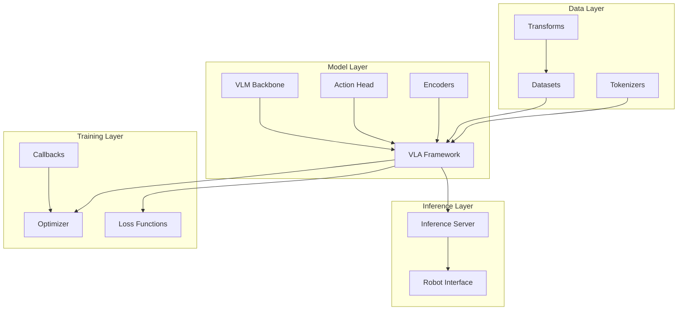

### Layer Breakdown

#### 1. Data Layer
Handles data loading, preprocessing, and augmentation:
- **Datasets**: Robot demonstration data (RLDS, HDF5, custom formats)
- **Tokenizers**: Text and action tokenization
- **Transforms**: Image augmentation, normalization, action space transformations

#### 2. Model Layer
Core neural network components:
- **VLM Backbone**: Vision-Language Models for multimodal understanding
- **Action Heads**: Action prediction modules (MLP, diffusion, flow matching)
- **Encoders**: State, history, and fusion encoders
- **VLA Framework**: Complete VLA architectures combining all components

#### 3. Training Layer
Training infrastructure:
- **Optimizers**: AdamW, Lion, etc.
- **Loss Functions**: MSE, cross-entropy, KL divergence, diffusion losses
- **Callbacks**: Checkpointing, logging, early stopping

#### 4. Inference Layer
Deployment and execution:
- **Inference Server**: FastAPI/gRPC server for model serving
- **Robot Interface**: Hardware communication layer

## Component Relationships

### VLA Framework Composition

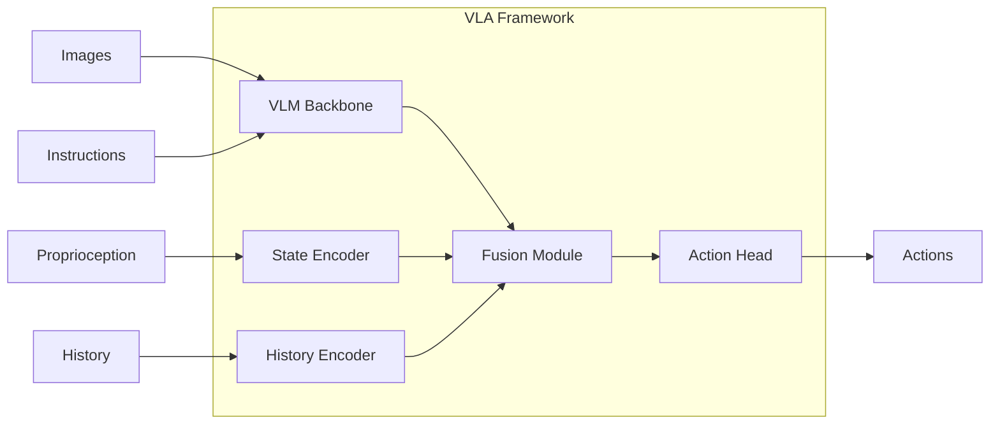

### Component Dependencies

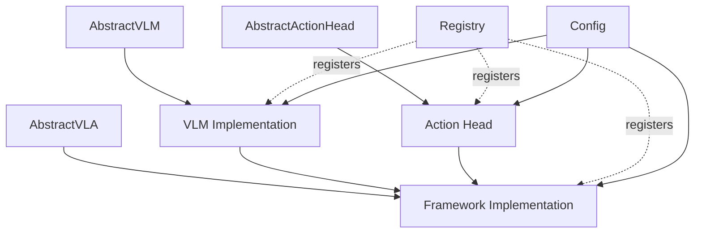

## Data Flow

### Training Data Flow

```mermaid
sequenceDiagram
    participant DS as Dataset
    participant TF as Transform
    participant FW as VLA Framework
    participant LOSS as Loss
    participant OPT as Optimizer
    
    DS->>TF: Raw data
    TF->>FW: Preprocessed batch
    Note over FW: Forward Pass
    FW->>LOSS: Predictions + Targets
    LOSS->>OPT: Gradients
    OPT->>FW: Parameter update
```

### Inference Data Flow

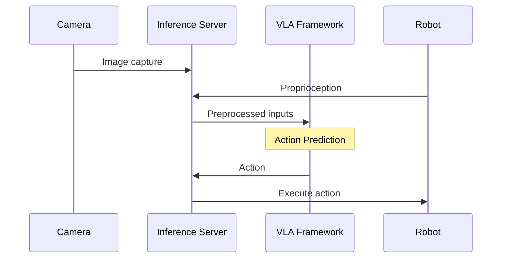

### Framework-Specific Data Flow

#### GR00T (Diffusion-based)
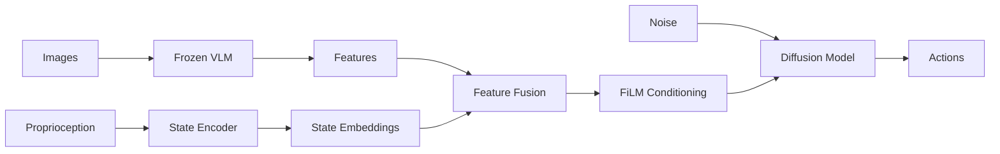

#### RT-2 (Token-based)
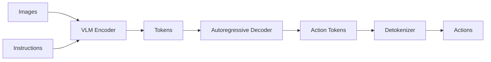

#### ACT (Chunking)
```mermaid
graph LR
    IMG[Images] --> VIS[Vision Encoder]
    PROP[Proprioception] --> SE[State Encoder]
    
    VIS --> ENC[Transformer Encoder]
    SE --> ENC
    
    LATENT[z ~ N(0,I)] --> DEC[Transformer Decoder]
    ENC --> DEC
    DEC --> CHUNK[Action Chunk]
    CHUNK --> ACT[Actions t:t+k]
```

## Registry Pattern

The registry pattern is central to LibroBot's extensibility. It allows components to be registered and discovered at runtime without modifying core code.

### Registry Architecture

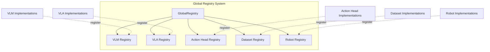

### Registry Implementation

```python
# Global registry manager
class GlobalRegistry:
    _registries: Dict[str, Registry] = {}
    
    @classmethod
    def get_registry(cls, name: str) -> Registry:
        if name not in cls._registries:
            cls._registries[name] = Registry(name)
        return cls._registries[name]

# Specific registry
class Registry:
    def __init__(self, name: str):
        self.name = name
        self._registry: Dict[str, Type] = {}
        self._aliases: Dict[str, str] = {}
    
    def register(self, name=None, aliases=None):
        """Decorator to register a class"""
        def decorator(cls):
            reg_name = name or cls.__name__
            self._registry[reg_name] = cls
            if aliases:
                for alias in aliases:
                    self._aliases[alias] = reg_name
            return cls
        return decorator
    
    def get(self, name: str) -> Type:
        """Get registered class"""
        if name in self._aliases:
            name = self._aliases[name]
        return self._registry[name]
    
    def create(self, name: str, *args, **kwargs):
        """Create instance of registered class"""
        cls = self.get(name)
        return cls(*args, **kwargs)
```

### Usage Examples

```python
# Register a VLM
from librobot.models.vlm.registry import register_vlm

@register_vlm(name="my-vlm", aliases=["mvlm"])
class MyVLM(AbstractVLM):
    pass

# Create from registry
from librobot.models.vlm.registry import create_vlm
vlm = create_vlm("my-vlm", hidden_dim=768)
vlm = create_vlm("mvlm", hidden_dim=768)  # Using alias

# Register a VLA framework
from librobot.models.frameworks.registry import register_vla

@register_vla(name="my-framework", aliases=["mf"])
class MyFramework(AbstractVLA):
    pass

# Create from registry
from librobot.models.frameworks.registry import create_vla
vla = create_vla("my-framework", vlm=vlm, action_dim=7)
```

### Benefits of Registry Pattern

1. **No Core Modifications**: Add new components without changing existing code
2. **Dynamic Discovery**: Components are discovered at import time
3. **Alias Support**: Multiple names for the same component
4. **Type Safety**: Registry maintains type information
5. **Easy Testing**: Mock components can be registered for testing

## Plugin Architecture

LibroBot uses a plugin architecture to allow easy extension of functionality.

### Plugin Types

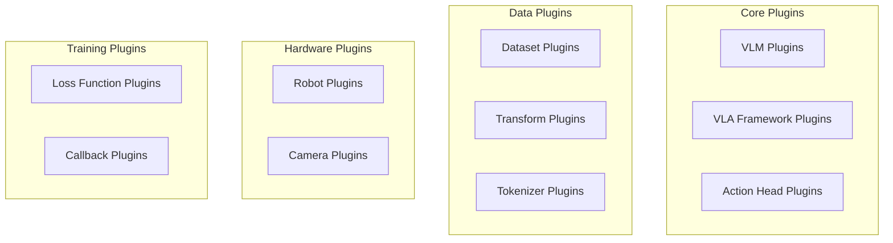

### Plugin Interface Pattern

All plugins follow a consistent interface pattern:

```python
# 1. Define abstract base class
class AbstractPlugin(ABC):
    @abstractmethod
    def core_method(self, *args, **kwargs):
        pass

# 2. Create registry
PLUGIN_REGISTRY = GlobalRegistry.get_registry("plugin_name")

def register_plugin(name=None, aliases=None):
    return PLUGIN_REGISTRY.register(name=name, aliases=aliases)

# 3. Implement plugin
@register_plugin(name="my-plugin")
class MyPlugin(AbstractPlugin):
    def core_method(self, *args, **kwargs):
        # Implementation
        pass

# 4. Use plugin
from librobot.plugins import create_plugin
plugin = create_plugin("my-plugin", **config)
```

### Creating a Custom Plugin

See [COMPONENT_GUIDE.md](./COMPONENT_GUIDE.md) for detailed instructions on creating plugins for:
- VLM backends
- VLA frameworks
- Action heads
- Datasets
- Robots

## Module Deep Dive

### 1. Models Module (`librobot/models/`)

#### VLM Module (`vlm/`)

Contains Vision-Language Model implementations.

**Structure:**
```
vlm/
├── base.py              # AbstractVLM interface
├── registry.py          # VLM registry
├── qwen_vl.py          # Qwen2-VL & Qwen3-VL (2B, 4B, 7B)
├── florence.py         # Florence-2 (base 230M, large 770M)
├── paligemma.py        # PaliGemma (3B)
├── internvl.py         # InternVL2 (2B, 8B)
├── llava.py            # LLaVA (7B, 13B)
├── adapters/           # LoRA, QLoRA adapters
│   ├── lora.py
│   └── qlora.py
└── utils/              # KV cache, attention utilities
    ├── kv_cache.py
    └── attention_sink.py
```

**Key Classes:**
- `AbstractVLM`: Base interface all VLMs must implement
- `VLMConfig`: Configuration dataclass for VLMs
- Adapter classes for parameter-efficient fine-tuning

#### Frameworks Module (`frameworks/`)

Contains complete VLA framework implementations.

**Structure:**
```
frameworks/
├── base.py              # AbstractVLA interface
├── registry.py          # VLA framework registry
├── groot_style.py      # NVIDIA GR00T
├── pi0_style.py        # Physical Intelligence π0
├── octo_style.py       # Berkeley Octo
├── openvla_style.py    # Berkeley OpenVLA
├── rt2_style.py        # Google RT-2
├── act_style.py        # ALOHA ACT
├── helix_style.py      # Figure AI Helix
└── custom.py           # Custom framework template
```

**Key Classes:**
- `AbstractVLA`: Base interface all frameworks must implement
- `VLAConfig`: Configuration for frameworks

#### Action Heads Module (`action_heads/`)

Implements various action prediction mechanisms.

**Structure:**
```
action_heads/
├── base.py                    # AbstractActionHead
├── registry.py                # Action head registry
├── mlp_oft.py                # Output-from-tokens MLP
├── transformer_act.py        # Transformer-based (ACT)
├── autoregressive_fast.py    # Fast autoregressive
├── hybrid.py                  # Hybrid approaches
├── diffusion/
│   ├── ddpm.py               # Denoising Diffusion
│   ├── ddim.py               # Deterministic DDIM
│   └── edm.py                # Elucidated Diffusion
└── flow_matching/
    ├── rectified_flow.py     # Rectified Flow
    └── ot_cfm.py             # Optimal Transport CFM
```

#### Encoders Module (`encoders/`)

Various encoder architectures for different modalities.

**Structure:**
```
encoders/
├── state/                    # State/proprioception encoders
│   ├── mlp.py
│   └── transformer.py
├── history/                  # Temporal history encoders
│   ├── lstm.py
│   └── transformer.py
└── fusion/                   # Multi-modal fusion
    ├── attention_fusion.py
    └── film_fusion.py
```

#### Components Module (`components/`)

Reusable neural network building blocks.

**Structure:**
```
components/
├── activations.py           # SwiGLU, GeGLU, etc.
├── attention/
│   ├── standard.py          # Standard attention
│   ├── flash_attention.py  # Flash Attention 2
│   ├── sliding_window.py   # Sliding window attention
│   └── block_wise.py        # Block-wise attention
├── normalization/
│   ├── layernorm.py
│   ├── rmsnorm.py
│   └── groupnorm.py
└── positional/
    ├── sinusoidal.py        # Sinusoidal embeddings
    ├── rotary.py            # RoPE
    └── alibi.py             # ALiBi
```

### 2. Data Module (`librobot/data/`)

Handles data loading, preprocessing, and augmentation.

**Structure:**
```
data/
├── datasets/
│   ├── base.py              # AbstractDataset
│   ├── registry.py          # Dataset registry
│   ├── rlds_dataset.py     # RLDS format
│   └── hdf5_dataset.py     # HDF5 format
├── transforms/
│   ├── image_transforms.py
│   └── action_transforms.py
└── tokenizers/
    ├── action_tokenizer.py
    └── text_tokenizer.py
```

### 3. Training Module (`librobot/training/`)

Training infrastructure and utilities.

**Structure:**
```
training/
├── trainer.py               # Main training loop
├── losses/
│   ├── action_loss.py
│   ├── vq_loss.py
│   └── diffusion_loss.py
└── callbacks/
    ├── checkpoint.py
    ├── logging.py
    └── early_stopping.py
```

### 4. Inference Module (`librobot/inference/`)

Model serving and inference.

**Structure:**
```
inference/
├── predictor.py            # Base predictor
├── batched_predictor.py   # Batched inference
└── server/
    ├── fastapi_server.py  # FastAPI server
    └── grpc_server.py     # gRPC server
```

### 5. Robots Module (`librobot/robots/`)

Robot hardware interfaces.

**Structure:**
```
robots/
├── base.py                 # AbstractRobot
├── registry.py             # Robot registry
├── so100_arm.py           # SO-100 robot arm
├── humanoid.py            # Humanoid robot
└── wheel_loader.py        # Wheel loader
```

### 6. Evaluation Module (`librobot/evaluation/`)

Model evaluation and benchmarking.

**Structure:**
```
evaluation/
├── metrics.py              # Success rate, FPS, etc.
├── benchmarks.py          # Standard benchmarks
└── sim_evaluation.py      # Simulation evaluation
```

### 7. Utils Module (`librobot/utils/`)

Shared utilities.

**Structure:**
```
utils/
├── registry.py             # Global registry system
├── config.py              # Configuration management
├── checkpoint.py          # Model checkpointing
└── device.py              # Device management
```

## Configuration System

LibroBot uses a hierarchical configuration system:

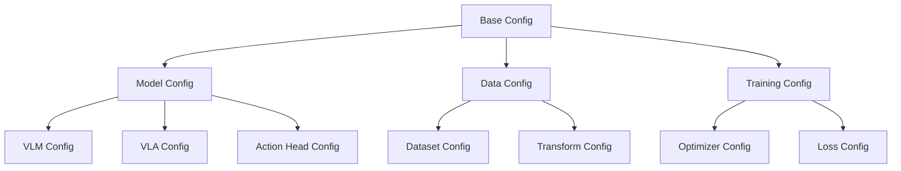

### Configuration Example

```yaml
# config.yaml
model:
  framework: groot
  vlm:
    name: qwen2-vl-2b
    freeze_vision: true
    freeze_language: true
  action_head:
    type: diffusion
    num_timesteps: 100
  state_encoder:
    type: mlp
    hidden_dim: 512
    num_layers: 3

data:
  dataset: rlds
  batch_size: 32
  num_workers: 4
  transforms:
    - random_crop: 224
    - normalize: imagenet

training:
  optimizer: adamw
  lr: 1e-4
  epochs: 100
  gradient_clip: 1.0
```

## Multi-GPU and Distributed Training

LibroBot supports various distributed training strategies:

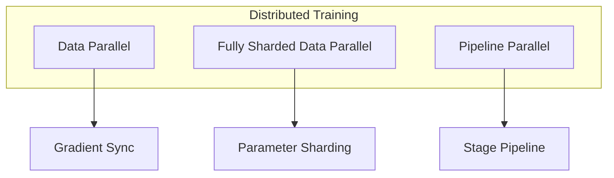

## Performance Optimization

### Memory Optimization Techniques

1. **Gradient Checkpointing**: Trade compute for memory
2. **Mixed Precision Training**: FP16/BF16 training
3. **Flash Attention**: Memory-efficient attention
4. **Parameter Sharding**: FSDP for large models
5. **KV Cache**: Efficient autoregressive generation

### Compute Optimization Techniques

1. **Operator Fusion**: Combine operations
2. **Kernel Optimization**: Custom CUDA kernels
3. **Batching**: Efficient batch processing
4. **Model Compilation**: TorchScript, torch.compile()

## Security Considerations

1. **Input Validation**: All inputs validated for shape and type
2. **Safe Deserialization**: `torch.load` with caution
3. **Access Control**: API authentication for inference servers
4. **Model Checkpoints**: Verify checksums before loading

## Testing Strategy

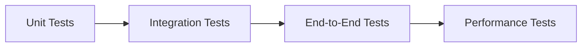

- **Unit Tests**: Individual component functionality
- **Integration Tests**: Component interactions
- **End-to-End Tests**: Full pipeline validation
- **Performance Tests**: Speed and memory benchmarks

## Conclusion

The LibroBot VLA framework provides a comprehensive, modular, and extensible architecture for building vision-language-action models. The registry pattern and plugin architecture enable easy customization while maintaining code quality and type safety.

For more details:
- [Project Structure](./PROJECT_STRUCTURE.md)
- [Design Principles](./DESIGN_PRINCIPLES.md)
- [Component Guide](./COMPONENT_GUIDE.md)
- [API Contracts](./API_CONTRACTS.md)
