# Computing Platform Architecture

## Overview

This document describes the computing platform architecture for deploying LibroBot VLA in a wheel loader application. The system uses a split architecture with a high-performance computing (HPC) server running the core VLA model and an edge proxy on the vehicle, connected via WiFi 7.

## System Architecture

```mermaid
graph TB
    subgraph HPC["🖥️ HPC Server (Off-Vehicle)"]
        direction TB
        CPU["AMD Ryzen 9 9950X\n16C/32T, 5.7 GHz Boost\n170W TDP"]
        GPU["NVIDIA RTX 5090\n32 GB GDDR7, 1799 GB/s\nBlackwell Architecture"]
        VLA["Core VLA Model\n(LibroBot VLA Framework)"]
        CPU --- VLA
        GPU --- VLA
    end

    subgraph WIFI["📡 Quantenna WiFi 7 (IEEE 802.11be)"]
        direction TB
        W7["onsemi Quantenna QCS WiFi 7\nMulti-Link Operation (MLO)\nUp to 46 Gbps Peak Throughput\n320 MHz Channel Bandwidth\n4096-QAM / < 2 ms Latency"]
    end

    subgraph VEHICLE["🚜 Wheel Loader (On-Vehicle)"]
        direction TB
        subgraph ORIN["NVIDIA Jetson Orin NX 16 GB\n100 TOPS / Proxy Node"]
            PROXY["VLA Proxy Service\n(Inference Relay + Buffering)"]
            VSLAM["Visual SLAM\n(On-Device)"]
        end

        subgraph CAMERAS["Camera Sensors"]
            OAK["OAK-FFC 4P\n(Luxonis, 4× MIPI Cameras)\nSurround View + V-SLAM\nUSB 3.1 Gen 1"]
            ZED["ZED Camera\n(Stereolabs ZED 2i)\nStereo Depth + RGB\nUSB 3.0"]
        end

        LOADER["Wheel Loader\nCAN Bus / Serial\nActuator Control"]
    end

    OAK -->|"USB 3.1"| PROXY
    OAK -->|"IMU + Stereo"| VSLAM
    ZED -->|"USB 3.0"| PROXY

    PROXY <-->|"WiFi 7\nImage Upload ↑\nAction Commands ↓"| W7
    W7 <-->|"WiFi 7"| VLA

    PROXY -->|"CAN Bus / Serial\nAction Commands"| LOADER
```

## Component Details

### HPC Server

The HPC server hosts the core VLA model and handles the computationally intensive inference workload.

| Component | Specification |
|---|---|
| **CPU** | AMD Ryzen 9 9950X — 16 cores / 32 threads, up to 5.7 GHz boost, 170W TDP |
| **GPU** | NVIDIA RTX 5090 — 32 GB GDDR7, 1799 GB/s memory bandwidth, Blackwell architecture |
| **Role** | Runs the full VLA pipeline: VLM backbone → fusion → action head inference |

### WiFi 7 — Quantenna (onsemi) QCS WiFi 7

The wireless link uses a Quantenna (onsemi) QCS-series WiFi 7 chipset. Quantenna is an industry leader in carrier-grade WiFi silicon, now part of onsemi. The QCS WiFi 7 platform provides the ultra-low latency and high throughput required for real-time VLA image streaming and action command delivery.

| Feature | Specification |
|---|---|
| **Chipset** | onsemi Quantenna QCS WiFi 7 |
| **Standard** | IEEE 802.11be (WiFi 7) |
| **Peak Throughput** | Up to 46 Gbps |
| **Channel Bandwidth** | Up to 320 MHz (doubled from WiFi 6) |
| **Modulation** | 4096-QAM (higher data density per symbol) |
| **Spatial Streams** | Up to 8+ (up to 12 on high-end SKUs) |
| **Multi-Link Operation (MLO)** | Simultaneous transmission across 2.4 GHz, 5 GHz, and 6 GHz bands |
| **Latency** | < 2 ms deterministic latency |
| **Security** | WPA3, industrial-grade encryption |
| **WiFi Sensing** | Channel State Information (CSI) extraction for AI-based environment awareness |
| **Key Benefit** | MLO enables real-time image streaming and low-latency action command delivery by bonding multiple frequency bands simultaneously |

### Jetson Orin NX (Vehicle Proxy)

The NVIDIA Jetson Orin NX serves as the on-vehicle edge proxy, bridging the cameras and actuators with the remote HPC.

| Component | Specification |
|---|---|
| **Module** | NVIDIA Jetson Orin NX 16 GB |
| **AI Performance** | 100 TOPS (INT8 sparse) / 50 TOPS (INT8 dense) |
| **GPU** | 1024-core NVIDIA Ampere GPU, 32 Tensor Cores |
| **CPU** | 8-core Arm Cortex-A78AE v8.2 64-bit |
| **Memory** | 16 GB 128-bit LPDDR5, 102.4 GB/s bandwidth |
| **Power** | Configurable 10 W / 15 W / 25 W modes |
| **Role** | Proxy: camera capture, V-SLAM, image preprocessing, WiFi 7 uplink, action command relay |
| **Camera Interfaces** | USB 3.1 (OAK-FFC 4P) + USB 3.0 (ZED 2i) |
| **Vehicle Interface** | CAN Bus / Serial to wheel loader actuators |

### Camera Sensors

| Camera | Key Features |
|---|---|
| **Luxonis OAK-FFC 4P** | 4× FFC camera modules (2× 2-lane MIPI + 2× 4-lane MIPI), surround view + V-SLAM, OAK-SoM-Pro (RVC2 VPU, 4 TOPS), BNO086 9-axis IMU, H.265/H.264 encoding up to 4K30, USB 3.1 Gen 1 |
| **Stereolabs ZED 2i** | Stereo depth + RGB, built-in IMU, IP66 rated, USB 3.0 |

### Wheel Loader

The wheel loader receives action commands from the Orin NX proxy over CAN Bus or serial interface. The commands originate from the VLA model running on the HPC and are relayed through the WiFi 7 link.

## Data Flow

```mermaid
sequenceDiagram
    participant OAK as OAK-FFC 4P
    participant ZED as ZED Camera
    participant ORIN as Orin NX 16 GB (Proxy)
    participant WIFI as Quantenna WiFi 7
    participant HPC as HPC (RTX 5090)
    participant LOADER as Wheel Loader

    Note over OAK,ZED: Continuous capture at 30 fps

    OAK->>ORIN: 4× surround RGB + Depth (USB 3.1)
    ZED->>ORIN: RGB + Depth frames (USB 3.0)

    ORIN->>ORIN: V-SLAM (pose estimation)
    ORIN->>ORIN: Preprocess & encode images

    ORIN->>WIFI: Upload image batch
    WIFI->>HPC: Image batch (< 2 ms link latency)

    HPC->>HPC: VLA Inference (VLM → Fusion → Action Head)

    HPC->>WIFI: Action commands
    WIFI->>ORIN: Action commands (< 2 ms link latency)

    ORIN->>LOADER: Execute actions (CAN Bus / Serial)
```

## Network Topology

WiFi 7 Multi-Link Operation (MLO) enables the system to use all three frequency bands simultaneously, assigning traffic by priority:

- **6 GHz band**: Primary image streaming — widest channel (320 MHz) for maximum throughput
- **5 GHz band**: Action command delivery — low-latency, low-interference path
- **2.4 GHz band**: Telemetry and heartbeat — reliable long-range fallback
